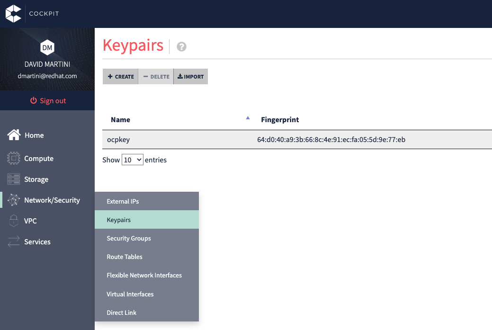

# Infrastructe part for OpenShift deployment

## 1.Description

These different scripts are Hashicorp Terraform scripts used to deploy all cloud components mandatory as prerequisits before to deploy OpenShift cluster. It take in charge for example the deployment of :  
* VPC  
* Internet Gateway
* Nat Gateway
* Routes table
* Bastion VM
* etc...    

## 2. Prerequisites

- Install Terraform CLI on your workstation **->** [Install Link](https://learn.hashicorp.com/tutorials/terraform/install-cli)

## 3. Deploy all components with Terraform

- Create a ssh key in your OutScale space  



- Check Terraform version
```
[root@workstation ~]# terraform version
Terraform v1.2.3
on linux_amd64
```

- Initalize Terraform plugin to download OutScale Plugin
```
[root@workstation 01_ocp_create_network]# terraform init

Initializing the backend...

Initializing provider plugins...
- Finding outscale-dev/outscale versions matching "0.5.3"...
- Installing outscale-dev/outscale v0.5.3...
- Installed outscale-dev/outscale v0.5.3 (signed by a HashiCorp partner, key ID 2EDF9494805B9D61)
```

- Deploy components with Terraform and your OutScale vars.
> :heavy_exclamation_mark: Reserve one IP for VM **ocpinfra01** and put this ip as DNS
```
root@workstation 01_ocp_create_network]# terraform apply
var.access_key_id
  Your Outscale access key

  Enter a value: 467G6BG... --> Your AK

var.dns1_ip
  DNS server 1 IP

  Enter a value: 192.168.2.200 --> Your reserved IP for ocpinfra01 VM

var.dns2_ip
  DNS server 2 IP

  Enter a value: 8.8.8.8 --> Your prefered DNS server

var.dns3_ip
  DNS server 3 IP

  Enter a value: 1.1.1.1 --> Your prefered DNS server

var.image_id
  Image ID used to deploy the bastion VM

  Enter a value: ami-f929abe8 --> Fedora AMI as Bastion VM

var.keypair_name
  keypaire name used for bastion VM

  Enter a value: ocpkey --> Your ssh key in OutScale

var.region
  Your Outscale region

  Enter a value: eu-west-2 --> Your OutScale region

var.secret_key_id
  Your Outscale secret key

  Enter a value: 456SL80N... --> Your SK

var.vm_type
  The flavor used to deploy the bastion VM

  Enter a value: tinav4.c1r2p2 --> Bastion VM flavor

data.outscale_subregions.all-subregions: Reading...
data.outscale_subregions.all-subregions: Read complete after 0s [id=terraform-20220620095043096700000001]

```