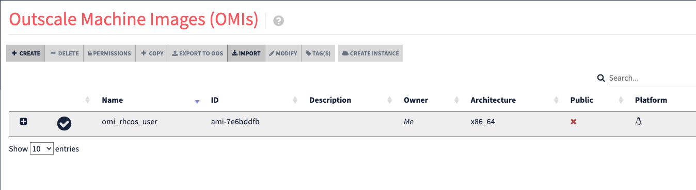

# RHCOS image for Outscale provider

## 1. Description

This development are Hashicorp Packer scripts to build and upload Red Hat CoreOS image on Outscale public cloud. This mandatory image is a standard image to deploy OpenShift masters and workers nodes.

## 2. Prerequisites

- Install Packer CLI on your workstation **->** [Install Link](https://learn.hashicorp.com/tutorials/packer/get-started-install-cli)

## 3. Build and deploy OutScale RHCOS image with Packer

- Check Packer version
```
[root@workstation ocp_outscale]# packer version
Packer v1.8.1
```

- Install OutScale plugin for Packer
```
[root@workstation ocp_outscale]# cd 02_ocp_packer_image
[root@workstation 02_ocp_packer_image]# packer init -upgrade outscale.pkr.hcl 
Installed plugin github.com/hashicorp/outscale v1.0.2 in "/root/.config/packer/plugins/github.com/hashicorp/outscale/packer-plugin-outscale_v1.0.2_x5.0_linux_amd64"
[root@workstation 02_ocp_packer_image]# packer plugins installed
/root/.config/packer/plugins/github.com/hashicorp/outscale/packer-plugin-outscale_v1.0.2_x5.0_linux_amd64
```

- Replace vars by your OutScale data in Packer file
```
[root@workstation 02_ocp_packer_image]# vim outscale.pkr.hcl
...
variable "access_key" {
  type =  string
  default = "$YOUR_ACCESS_KEY" --> Your AK
  // Sensitive vars are hidden from output as of Packer v1.6.5
  sensitive = true
}

variable "secret_key" {
  type =  string
  default = "$YOUR_SECRET_KEY" --> Your SK
  // Sensitive vars are hidden from output as of Packer v1.6.5
  sensitive = true
}

variable "region" {
  type =  string
  default = "$YOUR_REGION" --> Your OutScale Region
}

variable "keypair_name" {
  type =  string
  default = "$YOUR_SSH_KEY" --> Your OutScale SSH Key
}

variable "the_sg" {
  type =  string
  default = "$YOUR_SG" --> Your Security Group
}

variable "omi_source" {
  type =  string
  default = "$YOUR_SOURCE_OMI" --> Your source Fedora OMI (example : ami-f929abe8)
}

variable "ssh_path" {
  type =  string
  default = "$PRIVATE_KEY_PATH" --> The path of your private Key for your OutScale SSH Key 
}

variable "os_user" {
  type =  string
  default = "$USER_USED_TO_CONNECT" --> User in your OMI used to connect by SSH (fedora for Fedora OMI)
}
...
```

- Create your OutScale RHCOS image
```
[root@workstation 02_ocp_packer_image]# packer build .
```

- Result


