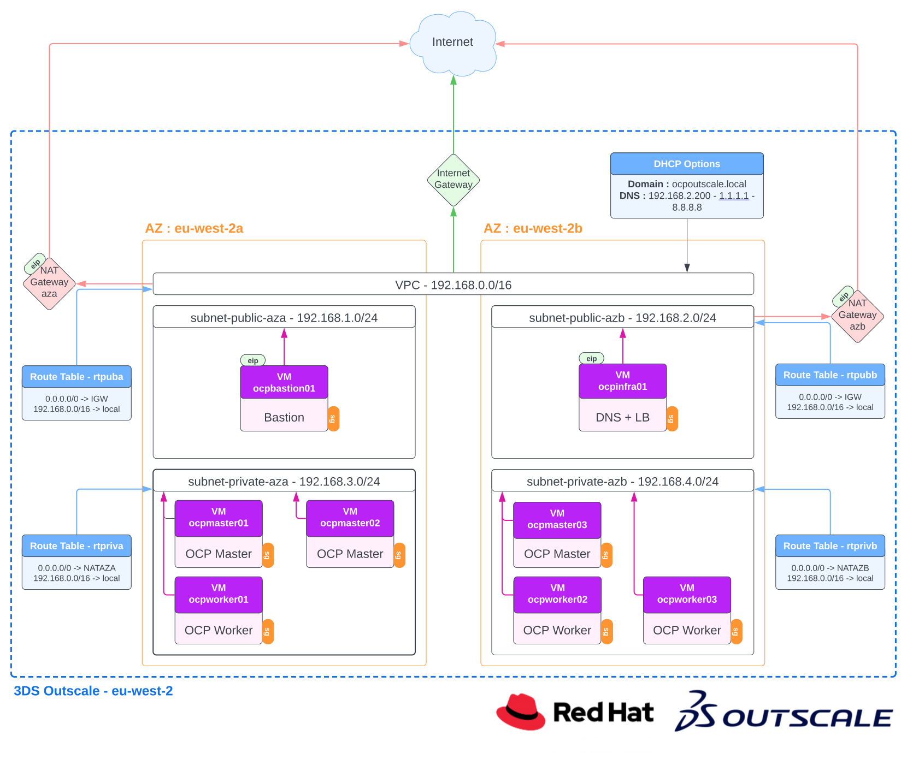

# OpenShift on 3DS Outscale

## 1. Description

All this code permits you to deploy an OCP cluster on 3DS Outscale automatically with Ansible. You have the possibility to set your parameters to adapt your cluster to your needs (number of nodes, cpu, memory, disk, etc...).

To install OCP in general, you have two methods :
* IPI : Installer Provide Infrastructure
* UPI : User Provide Infrastructure

## 2. Architecture
 
 

## 3. What this automation do

* Create and deploy a Red Hat CoreOS image for your 3DS OutScale space.

* Deploy all infrastructure part in your OutScale space (VPC, Internet Gatway, route tables, etc...)

* Deploy a bastion VM in your VPC

* Deploy an infrastructure VM with :
	- A DNS server with all needed records for your OCP cluster (api, api-int, *.apps, etc...)
	- A Load Balancer based on HAProxy as endpoint for the OCP cluster with 4 frontends

* Deploy a temporary OCP bootstrap node to install your cluster. This node will be deleted at the end of this automation.

* Deploy 3 OCP master nodes as requested by the user.

* Deploy x OCP worker nodes as requested by the user.

* Deploy GitOps (ArgoCD) on your OCP cluster if you requested it in vars file

To give you an estimate, a cluster with 6 worker nodes takes around 10 - 30 min to be up and running from scratch with this automation (depending your Internet connection)

**Note :** Today, this automation permit only to have master and worker nodes with dynamic IPs provided by 3DS Outscale (DHCP).

## 4. Files organization description

* **01_ocp_create_network :** files to create needed VPC and network components in your account automatically with Hashicorp Terraform*
* **02_ocp_packer_image :** files to create RHCOS images with Hashicorp Packer
* **03_ocp_install :** files to create OpenShift Cluster in your Outscale account with end to end automation based on Ansible and Hashicorp Terraform

## 5. Prerequisites

- [ ] Your environment have Internet access
- [ ] A 3DS Outscale space
- [ ] Red Hat account with valid subscription (RHEL, AAP, OCP)
	- RHEL8 BaseOS repo : rhel-8-for-x86_64-baseos-rpms
	- RHEL8 AppStream repo : rhel-8-for-x86_64-appstream-rpms
	- AAP2 repo : ansible-automation-platform-2.1-for-rhel-8-x86_64-rpms
- [ ] Ansible Execution Environment : 
	- quay.io/david_martini/ocp_outscale:4.10 to deploy OCP4.10
- [ ] One VM bastion used to deploy automation with :
	- RHEL8
	- podman
	- ansible-navigator
	- Ansible Execution Environment with all tools needed by this automation scripts
- [ ] A defined IP for your infravm (ex: 192.168.40.10). This server have a major role during deployment (DNS server & LB) and this IP is very important. This IP can be outside of the DHCP scope to haven't clash IP.

## 6. Ready to start?

- **Step 01** : Create all network components in your 3DS OutScale space **->** [**01_ocp_create_network**](01_ocp_create_network/README.md)
- **Step 02** : Create your RHCOS image in your 3DS OutScale account **->** [**02_ocp_packer_image**](02_ocp_packer_image/README.md)
- **Step 03** : Deploy your OpenShift Cluster in your 3DS OutScale space **->** [**03_ocp_install**](03_ocp_install/README.md)